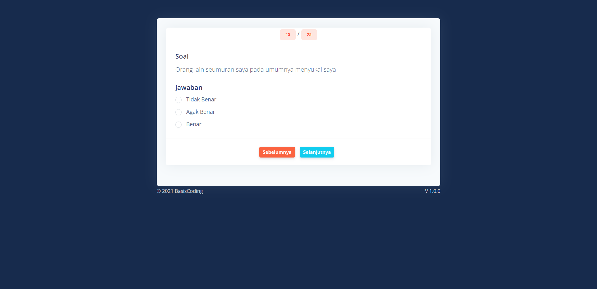
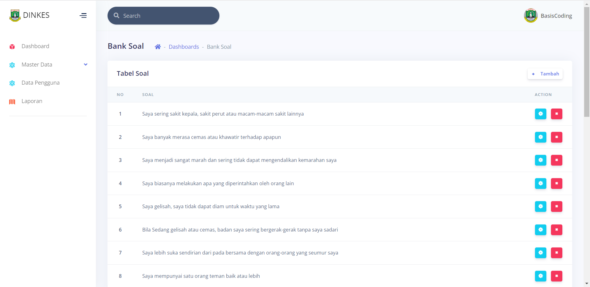
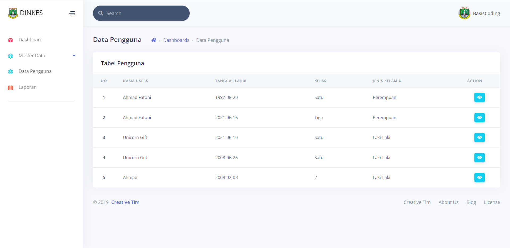
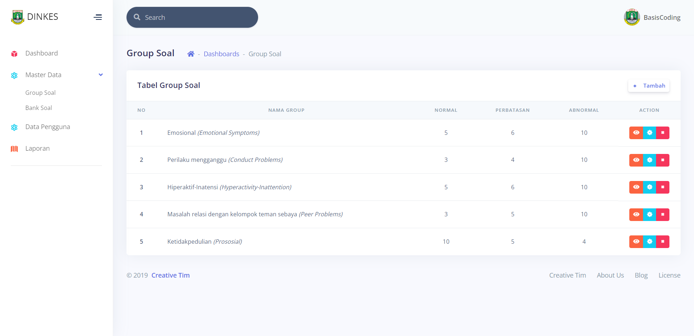
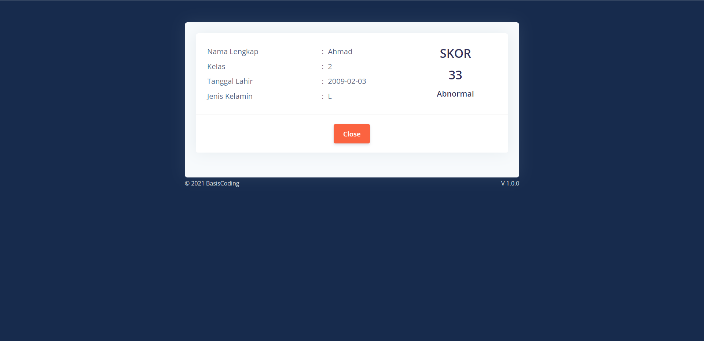
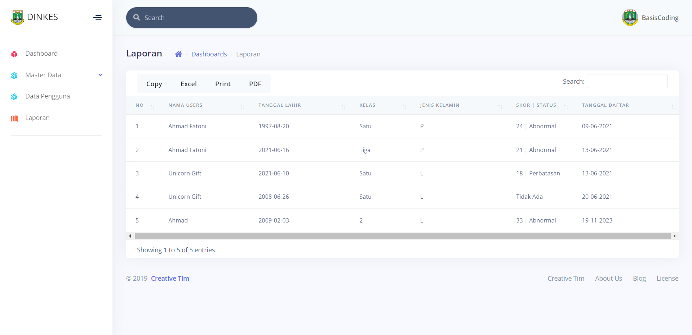

# Aplikasi Tes Kesehatan Mental Dinas Kesehatan

Aplikasi ini dikembangkan untuk melakukan tes kesehatan mental pada siswa di sekolah yang diadakan oleh Dinas Kesehatan. Aplikasi memiliki beberapa fitur untuk mengelola dan melaksanakan tes kesehatan mental.

## Fitur

1. **Soal Tes Kesehatan Mental**: Pengisian soal tes yang akan ditampilkan kepada siswa setelah registrasi.
2. **Bank Soal**: Manajemen bank soal untuk digunakan dalam tes.
3. **Data Pengguna**: Informasi dan manajemen data pengguna (admin).
4. **Master Data Group Soal**: Pengelolaan grup soal tes kesehatan mental.
5. **Skoring**: Penilaian dan skoring hasil tes kesehatan mental.
6. **Laporan**: Pembuatan laporan hasil tes kesehatan mental.

## Screenshot

### 1. Soal Tes Kesehatan Mental

### 2. Bank Soal

### 3. Data Pengguna

### 4. Master Data Group Soal

### 5. Skoring

### 6. Laporan

## Instalasi

1. Clone repositori ini: `git clone https://github.com/inotechno/tes-mental.git`
2. Impor struktur database dari `tes_mental.sql`.
3. Konfigurasi file `application/config/database.php` untuk pengaturan koneksi database.

## Role Akses

1. **Admin**: Akses penuh ke semua fitur aplikasi.
2. **Siswa**: Tidak memerlukan login. Siswa dapat langsung membuka halaman, melakukan registrasi, mengisi tes, dan melihat skoring.

## Kontribusi

Proyek ini terbuka untuk kontribusi. Jika Anda tertarik untuk berkontribusi atau melaporkan masalah, silakan buka issue atau pull request. Kami menyambut kontribusi Anda.

## Lisensi

Diberikan di bawah lisensi MIT - Lihat [LICENSE](LICENSE) untuk lebih lanjut.
